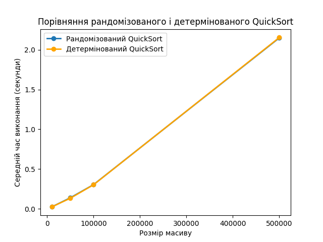

# Algorithms 2 Homework 10

### Task 1

Реалізувати рандомізований та детермінований алгоритми сортування 
QuickSort. Провести порівняльний аналіз їхньої ефективності, 
вимірявши середній час виконання на масивах різного розміру.

Результати

```
Розмір масиву: 10000
	Рандомізований QuickSort: 0.02452998161315918 секунд
	Детермінований QuickSort: 0.02447037696838379 секунд

Розмір масиву: 50000
	Рандомізований QuickSort: 0.13940248489379883 секунд
	Детермінований QuickSort: 0.13372654914855958 секунд

Розмір масиву: 100000
	Рандомізований QuickSort: 0.30471014976501465 секунд
	Детермінований QuickSort: 0.30303053855895995 секунд

Розмір масиву: 500000
	Рандомізований QuickSort: 2.149603796005249 секунд
	Детермінований QuickSort: 2.154080057144165 секунд
```




### Task 2

Реалізувати програму для складання розкладу занять в університеті,
використовуючи жадібний алгоритм для задачі покриття множини. 
Мета полягає в призначенні викладачів на предмети таким чином, 
щоб мінімізувати кількість викладачів та покрити всі предмети.

Результати

```
Розклад занять:
Наталія Шевченко, 29 років, email: n.shevchenko@example.com
   Викладає предмети: Біологія, Хімія

Дмитро Бондаренко, 35 років, email: d.bondarenko@example.com
   Викладає предмети: Фізика, Інформатика

Олександр Іваненко, 45 років, email: o.ivanenko@example.com
   Викладає предмети: Математика
```